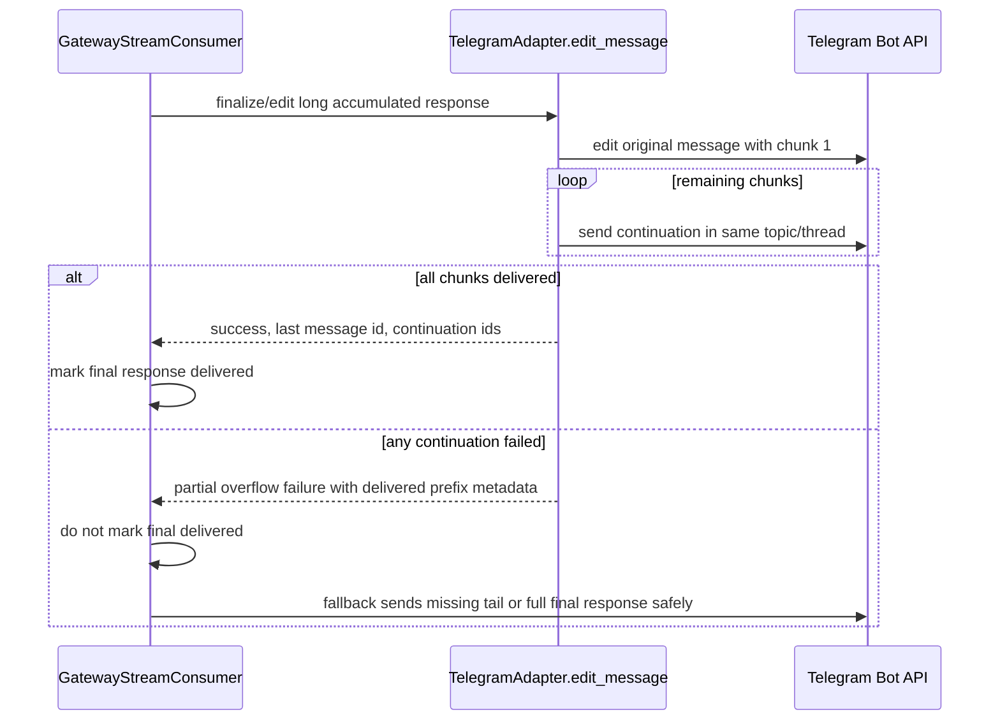

# fix: Prevent Telegram streamed replies from ending after first overflow chunk

## Summary

Fix a Telegram gateway bug where a long streamed assistant reply can appear to stop mid-answer in a topic after the first overflow chunk. The reported screenshot shows a long Hermes response in the `Nehemiah - Coding` Telegram topic ending at `- The visible tool-call summary`, followed by the user noting that the previous message did not finish streaming to that Telegram topic.

The plan targets the streamed edit overflow path, not general model generation. A completed assistant response must either reach Telegram in full across all continuation messages or leave enough state for the gateway fallback path to deliver the remaining content instead of marking the turn complete after a partial delivery.

---

## Problem Frame

Telegram limits message text to 4096 UTF-16 code units. Hermes streams gateway responses by editing a message and, when a streamed message grows past the limit, splitting the overflow into additional Telegram messages. The adapter already has a split-and-deliver path for oversized edits, but the partial-continuation failure contract is weak: if chunk 1 is edited successfully and a later continuation fails, the adapter can still report success for the operation. The stream consumer may then mark the final response delivered even though the visible topic only contains the first part.

This is especially visible in Telegram forum topics because a long final response can be split below tool-progress bubbles, and a missing continuation looks exactly like the stream stopped mid-answer.

---

## Requirements

- R1. Long streamed Telegram replies must preserve all final content across overflow chunks.
- R2. If any continuation chunk fails after the first overflow edit lands, the gateway must not mark the final response as fully delivered.
- R3. Continuation chunks must remain routed to the same Telegram topic/thread as the original response.
- R4. The fix must avoid duplicate full-answer sends when all overflow chunks were delivered successfully.
- R5. Tests must cover the reported failure shape: a final streamed reply that exceeds Telegram's limit, succeeds on the first edit, fails on a continuation, and must not be treated as complete.

---

## Key Technical Decisions

- Treat overflow delivery as all-or-not-complete. `_edit_overflow_split` should only return a successful final-delivery result when every planned chunk reaches Telegram. Partial delivery is a distinct outcome that downstream code can recover from.
- Carry partial-overflow metadata through `SendResult.raw_response` rather than adding a new public dataclass field unless implementation proves the existing result shape is insufficient. The stream consumer already inspects `SendResult` after adapter edits, so a small raw response contract can keep the change contained.
- Make the stream consumer responsible for final-delivery truth. The adapter knows which chunks landed, but the consumer owns `_final_response_sent`, `_final_content_delivered`, `_fallback_prefix`, and fallback final-send behaviour.
- Keep routing inside Telegram adapter helpers. Continuation sends should continue to use `_thread_kwargs_for_send(...)` with metadata-derived `message_thread_id` and reply anchors so forum topic behaviour stays consistent.

---

## High-Level Technical Design

---

## Implementation Units

### U1. Add a partial-overflow contract for Telegram edit splits

**Goal:** Make `TelegramAdapter._edit_overflow_split` distinguish complete overflow delivery from partial delivery.

**Requirements:** R1, R2, R4

**Dependencies:** None

**Files:**
- `gateway/platforms/telegram.py`
- `tests/gateway/test_telegram_send.py` or the existing Telegram adapter test module that already covers `edit_message` overflow behaviour

**Approach:**
- Keep the successful path unchanged when every chunk is delivered: return `SendResult(success=True, message_id=<last chunk>, continuation_message_ids=(...))`.
- When a continuation fails after the first edit, return a result that clearly indicates partial delivery instead of plain success. Prefer `success=False`, `retryable=True`, and `raw_response` metadata such as delivered chunk count, total chunk count, last delivered message id, and the visible delivered prefix.
- Preserve logging, but do not rely on logs as the only signal. The caller must be able to tell partial delivery happened.
- Ensure the first edited chunk and all successful continuation chunks still include the existing Markdown/plain-text fallback behaviour.

**Patterns to follow:**
- Existing overflow handling in `TelegramAdapter.edit_message` and `_edit_overflow_split`.
- Existing `SendResult` semantics in `gateway/platforms/base.py`, especially `retryable`, `raw_response`, and `continuation_message_ids`.

**Test scenarios:**
- Oversized finalized edit where all continuations succeed returns success, the last continuation id, and all continuation ids.
- Oversized finalized edit where the first continuation send fails returns a partial-overflow failure and does not report success.
- Oversized finalized edit where one continuation succeeds and a later continuation fails reports the last delivered continuation id and delivered count in raw metadata.
- A continuation MarkdownV2 formatting failure still retries plain text before being treated as a delivery failure.

**Verification:** Adapter tests prove complete overflow remains successful and partial overflow is observable by the caller.

### U2. Teach the stream consumer to recover from partial overflow

**Goal:** Ensure a partial Telegram overflow does not set `_final_response_sent` or `_final_content_delivered` unless the full response reached the user.

**Requirements:** R1, R2, R4, R5

**Dependencies:** U1

**Files:**
- `gateway/stream_consumer.py`
- `tests/gateway/test_stream_consumer.py` or a focused new `tests/gateway/test_stream_consumer_telegram_overflow.py`

**Approach:**
- In `_send_or_edit`, when `adapter.edit_message(...)` returns a partial-overflow failure, update consumer state to reflect the last visible prefix/message and enter fallback delivery for the missing content.
- Avoid treating `_already_sent` as final delivery. A partial visible message can be true while final delivery is false.
- Use the delivered-prefix metadata if available so `_send_fallback_final(...)` sends only the missing tail. If implementation finds the prefix is unreliable after Markdown formatting, prefer sending the complete final response as a fresh fallback message rather than silently dropping the tail.
- Keep the existing success handling for `continuation_message_ids` when the adapter delivered all chunks.

**Patterns to follow:**
- Existing fallback mode in `GatewayStreamConsumer._send_or_edit` and `_send_fallback_final`.
- Existing comments around `_final_response_sent`, `_final_content_delivered`, and `_fallback_prefix` for prior partial-delivery regressions.

**Test scenarios:**
- A final streamed response that overflows and receives a complete-success edit split sets final-delivery flags and does not invoke fallback.
- A final streamed response whose adapter reports partial overflow does not set final-delivery flags immediately.
- After partial overflow, fallback delivery sends the remaining tail and then marks final content delivered only if the fallback send succeeds.
- If fallback delivery also fails, the consumer leaves final-delivery false so the gateway's non-streaming final-send safety path can still run.

**Verification:** Stream consumer tests reproduce the screenshot shape by simulating first chunk visible and continuation failure, then assert the final answer is not suppressed.

### U3. Preserve Telegram topic/thread routing for overflow and fallback continuations

**Goal:** Ensure overflow recovery messages land in the same Telegram forum topic or DM topic fallback context.

**Requirements:** R3

**Dependencies:** U1, U2

**Files:**
- `gateway/platforms/telegram.py`
- `gateway/stream_consumer.py`
- `tests/gateway/test_stream_consumer_thread_routing.py`
- Relevant Telegram adapter routing tests, if existing coverage is closer there

**Approach:**
- Keep passing `metadata` through every overflow continuation and fallback send.
- Keep reply anchors where valid, but do not let a missing reply anchor drop the `message_thread_id` for normal forum topics.
- For private DM topic fallback metadata, preserve the existing stricter anchor behaviour documented in the adapter comments.

**Patterns to follow:**
- `TelegramAdapter._thread_kwargs_for_send(...)`.
- Existing tests around Telegram topic recovery and stream consumer thread routing.

**Test scenarios:**
- Overflow continuations include `message_thread_id` for a forum topic.
- A continuation retry after `reply message not found` keeps forum topic routing when allowed.
- Partial-overflow fallback sends receive the same metadata passed to the original stream consumer.

**Verification:** Thread-routing assertions inspect fake bot calls and confirm all continuation/fallback messages carry the expected topic metadata.

### U4. Add issue evidence and PR body traceability

**Goal:** Make the upstream issue and PR clearly trace the user-visible bug and verification evidence.

**Requirements:** R5

**Dependencies:** U1, U2, U3

**Files:**
- GitHub issue body created via `gh issue create`
- PR body using `.github/PULL_REQUEST_TEMPLATE.md`

**Approach:**
- Create a GitHub issue with the screenshot evidence: the long message in the `Nehemiah - Coding` Telegram topic stops at `- The visible tool-call summary`, and the user's reply says the previous message did not finish streaming to that Telegram topic.
- Reference affected component as Gateway and platform as Telegram.
- In the PR body, link the issue with `Fixes #...`, describe the split-delivery contract change, and include the screenshot or attach it if GitHub upload is available.
- Follow `CONTRIBUTING.md` and the repository PR template exactly.

**Patterns to follow:**
- `.github/ISSUE_TEMPLATE/bug_report.yml`
- `.github/PULL_REQUEST_TEMPLATE.md`

**Test scenarios:**
- Test expectation: none, this is tracker and PR documentation work.

**Verification:** The GitHub issue exists with screenshot evidence or an explicit screenshot reference, and the PR body links the issue and lists the tests run.

---

## Scope Boundaries

### In Scope

- Telegram streamed response overflow splitting and recovery.
- Stream consumer final-delivery truth for partial overflow delivery.
- Topic/thread metadata preservation for overflow and fallback continuation sends.
- Focused unit tests around adapter and stream consumer behaviour.

### Out of Scope

- Changing model streaming semantics in `run_agent.py`.
- Reworking Telegram draft streaming, which is DM-only and not the forum-topic path in the screenshot.
- Changing general platform message splitting for Discord, Slack, WhatsApp, or Matrix unless a shared helper must be corrected for the Telegram fix.
- Altering tool-progress display settings or terminal progress rendering.

### Deferred to Follow-Up Work

- Broader observability for gateway delivery completeness across all messaging platforms.
- A user-facing resend/recover command for a previous truncated response.

---

## Risks & Mitigations

- Risk: fallback recovery duplicates already-visible first chunks. Mitigation: use delivered-prefix metadata where reliable and add tests for no-duplicate complete-success behaviour.
- Risk: preserving forum topic routing while dropping invalid reply anchors is easy to regress. Mitigation: include fake bot call assertions for `message_thread_id` and reply behaviour.
- Risk: MarkdownV2 formatting can alter visible/raw prefix comparisons. Mitigation: keep fallback conservative; duplicate content is preferable to silently missing content, but tests should keep the common path tail-only.

---

## Sources & Research

- User-provided screenshot at `/root/.hermes/image_cache/img_f664e68f6ddf.jpg`.
- `gateway/stream_consumer.py` streamed edit, overflow, fallback, and final-delivery state handling.
- `gateway/platforms/telegram.py` Telegram send/edit overflow splitting and topic routing helpers.
- `gateway/platforms/base.py` `SendResult` contract and shared message chunking helper.
- `tests/gateway/test_stream_consumer.py`, `tests/gateway/test_stream_consumer_thread_routing.py`, and Telegram adapter tests for focused regression coverage.

---

## Verification Strategy

- Run focused Telegram adapter overflow tests.
- Run focused stream consumer overflow/fallback tests.
- Run topic-routing tests affected by metadata changes.
- Run the gateway test subset around Telegram send/edit, stream consumer, and run progress if touched.
- Before PR creation, ensure `git diff` contains only the plan, implementation, tests, and PR/issue-relevant documentation for this bug.
