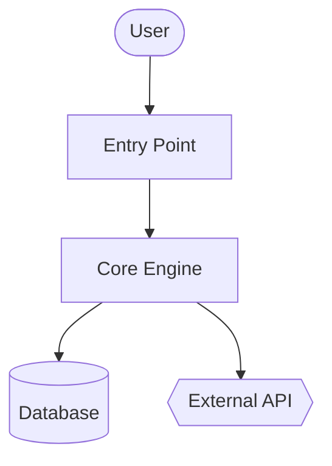
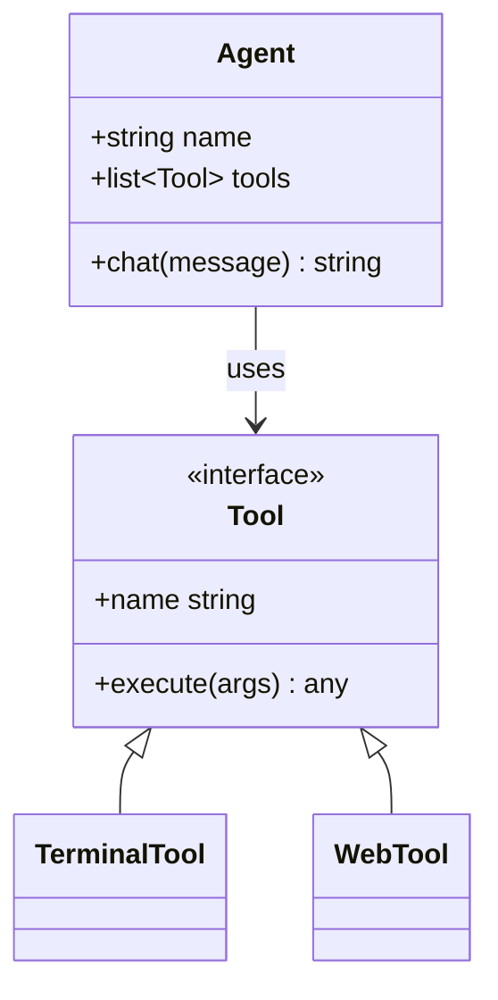
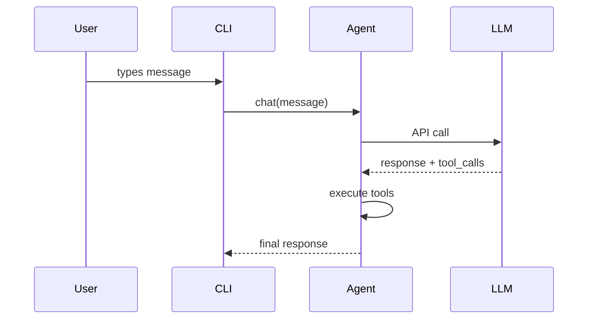

# Code Wiki Skill

Generate a comprehensive wiki for any codebase — overview, architecture, per-module deep-dives, Mermaid class and sequence diagrams. Inspired by Google CodeWiki, but works on local repos, private repos, and any language. Uses only existing Hermes tools (`terminal`, `read_file`, `search_files`, `write_file`); no Docker, no external services, no extra dependencies.

This skill produces **reference documentation** (what/how). It does not produce strategic narrative (why — that's a different skill).

## When to Use

- User says "document this codebase", "generate a wiki", "make architecture diagrams"
- Onboarding to an unfamiliar repo and wants a structured reference
- User points at a GitHub URL and asks for documentation
- Need a stable artifact (markdown + Mermaid) that renders on GitHub

Do NOT use this for:
- Single-file or single-function documentation — just answer directly
- API reference for one specific endpoint — use `read_file` and answer inline
- Strategic "why does this exist" narrative — different skill, different purpose
- Codebases the user is actively developing in this session — just answer questions as they come

## Prerequisites

- No env vars required.
- `git` on PATH for repo SHA tracking and remote clones.
- Optional: `pygount` for language-breakdown stats (see the `codebase-inspection` skill).

## How to Run

Invoke through the `terminal` tool from the target repo's root, then use `read_file` / `search_files` / `write_file` to produce the wiki. Default output location is `~/.hermes/wikis/<repo-name>/`. Only write into the repo (`docs/wiki/`) when the user explicitly requests it.

## Quick Reference

| Step | Action |
|---|---|
| 1 | Resolve target — local cwd, given path, or `git clone --depth 50 <url>` to a temp dir |
| 2 | Scan structure — `ls`, `find -maxdepth 3`, manifest files, README |
| 3 | Pick 8–10 modules to document |
| 4 | Write `README.md` (overview + module map) |
| 5 | Write `architecture.md` with Mermaid flowchart |
| 6 | Write per-module docs in `modules/` |
| 7 | Write `diagrams/class-diagram.md` (Mermaid classDiagram) |
| 8 | Write `diagrams/sequences.md` (Mermaid sequenceDiagram, 2–4 workflows) |
| 9 | Write `getting-started.md` |
| 10 | Write `api.md` if applicable, else skip |
| 11 | Write `.codewiki-state.json` |
| 12 | Report paths to user |

## Procedure

### 1. Resolve the target

For a GitHub URL:

```bash
WIKI_TMP=$(mktemp -d)
git clone --depth 50 <url> "$WIKI_TMP/repo"
cd "$WIKI_TMP/repo"
REPO_SHA=$(git rev-parse HEAD)
REPO_NAME=$(basename <url> .git)
```

For a local path (or cwd if none given):

```bash
cd <path>
REPO_SHA=$(git rev-parse HEAD 2>/dev/null || echo "uncommitted")
REPO_NAME=$(basename "$PWD")
```

Then set the output dir:

```bash
OUTPUT_DIR="$HOME/.hermes/wikis/$REPO_NAME"
mkdir -p "$OUTPUT_DIR/modules" "$OUTPUT_DIR/diagrams"
```

### 2. Scan repo structure

Use the `terminal` tool for the shell work, `read_file` for manifests:

```bash
# Shallow tree first
ls -la

# Deeper tree, noise filtered
find . -type d \
  -not -path '*/\.*' \
  -not -path '*/node_modules*' \
  -not -path '*/venv*' \
  -not -path '*/__pycache__*' \
  -not -path '*/dist*' \
  -not -path '*/build*' \
  -not -path '*/target*' \
  -maxdepth 3 | sort

# Language breakdown (skip if pygount unavailable)
pygount --format=summary \
  --folders-to-skip=".git,node_modules,venv,.venv,__pycache__,.cache,dist,build,target" \
  . 2>/dev/null || true
```

Then `read_file` the relevant manifests (`package.json`, `pyproject.toml`, `setup.py`, `Cargo.toml`, `go.mod`, `pom.xml`, `build.gradle`) and the project README. Use `search_files target='files'` to find them rather than guessing names.

### 3. Pick modules to document

Cap initial pass at **8–10 modules**. Heuristics by language:

- Python: top-level packages (dirs with `__init__.py`), plus subsystem dirs
- JS/TS: `src/<subdir>`, top-level workspace dirs
- Rust: each crate in a workspace, or top-level `src/<module>` dirs
- Go: each top-level package directory
- Mixed/unfamiliar: top-level directories that contain source code (not config, not tests)

For very large repos, prioritize by:
1. Imported-from count (a module imported by many is core)
2. LOC (bigger modules usually warrant their own doc)
3. Mentions in README / top-level docs

State the module list to the user before generating per-module docs on big repos — gives them a chance to redirect.

### 4. Write `README.md`

`read_file` the actual project README plus the top 2–3 entry-point files. Then `write_file`:

````markdown
# <Project Name>

<One paragraph: what it is and what it's for. Self-contained — don't assume the
reader has the source README.>

## Key Concepts

- **<Concept 1>** — <one line>
- **<Concept 2>** — <one line>

## Entry Points

- [`path/to/main.py`](<link>) — <what runs when you start it>
- [`path/to/cli.py`](<link>) — <CLI surface>

## High-Level Architecture

<2-3 sentences. Detail goes in architecture.md.>

See [architecture.md](architecture.md).

## Module Map

| Module | Purpose |
|---|---|
| [`<module>`](modules/<module>.md) | <one-line purpose> |

## Getting Started

See [getting-started.md](getting-started.md).
````

For link targets in local mode use relative paths. For cloned repos use `https://github.com/<owner>/<repo>/blob/<sha>/<path>` so links survive future commits.

### 5. Write `architecture.md`

````markdown
# Architecture

<2-3 paragraphs: shape of the system. What talks to what. Where data enters,
where it exits, where state lives.>

## Components

- **<Component>** — <1-2 sentences>. See [`modules/<module>.md`](modules/<module>.md).

## System Diagram



## Data Flow

1. **<Step>** — [`<file>`](<link>)
2. **<Step>** — [`<file>`](<link>)

## Key Design Decisions

- <Anything load-bearing the reader should know>
````

**Mermaid shape semantics:**
- `[]` = component
- `[()]` = database / storage
- `{{}}` = external service
- `(())` = entry point or terminal
- `-->` = sync call, `-.->` = async/event

Cap at ~20 nodes per diagram. Split into sub-diagrams if larger.

### 6. Write per-module docs in `modules/`

For each selected module, inspect its layout with `ls`, identify 3–5 most important files (by size, by being named `core.py` / `main.py` / `__init__.py`, by being imported a lot), then `read_file` those files (use `offset` / `limit` to read only what you need; prefer `search_files` for specific symbols).

````markdown
# Module: `<module>`

<1-2 sentence purpose.>

## Responsibilities

- <bullet>
- <bullet>

## Key Files

- [`<module>/<file>`](<link>) — <what it does>

## Public API

<Functions/classes/constants other code uses. Group related items. Show
signatures, not full implementations.>

## Internal Structure

<How the module is organized internally. State management.>

## Dependencies

- **Used by:** <other modules>
- **Uses:** <other modules + external libs>

## Notable Patterns / Gotchas

- <Anything non-obvious>
````

### 7. Write `diagrams/class-diagram.md`

Pick the 5–10 most important classes/types. `read_file` them, then write:

````markdown
# Class Diagram

## Core Types



## Notes

<Anything the diagram can't express — lifecycle, threading, etc.>
````

For languages without classes (Go, C, Rust): use the diagram for struct relationships, or skip class-diagram.md and explain it in prose in architecture.md. Don't force-fit.

### 8. Write `diagrams/sequences.md`

Pick 2–4 of the most important workflows. Trace each call path through the code (read entry point, follow function calls), then:

````markdown
# Sequence Diagrams

## Workflow: <Name>

<1 sentence describing what this does and when it runs.>



### Walkthrough

1. **User input** — [`cli.py:HermesCLI.run_session`](<link>)
2. **Message dispatch** — [`run_agent.py:AIAgent.chat`](<link>)
````

Don't invent participants. Every box must correspond to a real component the reader can find in the code.

### 9. Write `getting-started.md`

````markdown
# Getting Started

## Prerequisites

<From manifest files + README. Be specific — versions if pinned.>

## Installation

```bash
<exact commands>
```

## First Run

```bash
<minimum command to see the system do something useful>
```

## Common Workflows

### <Workflow 1>
<commands>

## Configuration

- `<config-file>` — <what it controls>
- Env var `<VAR>` — <what it controls>

## Where to Go Next

- Architecture: [architecture.md](architecture.md)
- Module reference: [README.md#module-map](README.md#module-map)
````

### 10. Write `api.md` (skip if not applicable)

Only write this if the project is a library or API server. If it is:

- Find the public API surface (`__init__.py` exports, OpenAPI specs, route handlers, exported types)
- Document each public entry with signature, parameters, return type, one-line description
- Group by category

### 11. Write the state file

```bash
cat > "$OUTPUT_DIR/.codewiki-state.json" <<EOF
{
  "repo_name": "$REPO_NAME",
  "source_path": "$PWD",
  "source_sha": "$REPO_SHA",
  "generated_at": "$(date -u +%Y-%m-%dT%H:%M:%SZ)",
  "generator": "hermes-agent code-wiki skill v0.1.0",
  "modules_documented": []
}
EOF
```

### 12. Report to user

State exactly what was generated and where:

```
Generated wiki at ~/.hermes/wikis/<repo-name>/:
  README.md                   project overview, module map
  architecture.md             system architecture + flowchart
  getting-started.md          setup, first run, workflows
  modules/<N files>           per-module deep-dives
  diagrams/architecture.md    Mermaid flowchart
  diagrams/class-diagram.md   Mermaid class diagram
  diagrams/sequences.md       Mermaid sequence diagrams
```

If you cloned to a temp dir, remind the user it can be removed (`rm -rf "$WIKI_TMP"`) after they've reviewed the wiki.

## Scope Control

Generating a full wiki for a 500K-LOC monorepo is wildly token-expensive. Default to bounded scope:

- Initial scan: max depth 3 directories
- Per-module docs: cap at 10 modules unless user expands scope
- Per-file reads: prefer `search_files` for symbols + `read_file` with `offset`/`limit` over full reads
- Skip vendored code (`vendor/`, `third_party/`, generated code, `_pb2.py`, `.min.js`)

If the user says "do the whole thing exhaustively", believe them — but ballpark the cost first: "this repo has ~340 source files, comprehensive coverage will be expensive — confirm?"

## Re-Run / Update

If `.codewiki-state.json` already exists at the target path:

- Read it for previous SHA and module list
- If source SHA matches: ask user if they want to regenerate or skip
- If SHA differs: offer to regenerate only modules with changed files (`git diff --name-only <old-sha> HEAD`)

Full incremental-regeneration is a future enhancement — for now, regenerating the whole thing is acceptable.

## Pitfalls

- **Fabricating components.** Every diagram node and claimed function call must be in the source. `read_file` before writing. The single biggest failure mode for auto-generated docs is plausible-sounding fabrication.
- **Generic AI prose.** "This module is responsible for..." is content-free. Say what the module actually does in domain-specific terms.
- **Restating code as prose.** A module doc that says "the `process` function processes things by calling `process_item` on each item" is worse than just linking to the function.
- **Mermaid > 50 nodes.** They don't render legibly. Split them.
- **Documenting tests, generated code, or vendored deps as if they were product code.** Skip them.
- **In-repo output without asking.** Default is `~/.hermes/wikis/`. Only write into the repo when the user explicitly requests it.
- **Mermaid special chars need quotes:** `A["Tool / Agent"]` not `A[Tool / Agent]`. `<br>` for line breaks inside a node.
- **Nested code fences in SKILL.md.** When writing a markdown example that contains a Mermaid block, use 4-backtick outer fences so the 3-backtick inner ` ```mermaid ` doesn't close the outer. (This SKILL.md does it.)
- **classDiagram generics** render as `~T~` (e.g. `List~Tool~`), not `<T>`.
- **GitHub Mermaid theme is fixed** — don't include `%%{init: ...}%%` blocks; they're stripped on render.

## Verification

After writing, verify:

1. **Mermaid blocks balance** — opens equal closes per file:
   ```bash
   for f in "$OUTPUT_DIR"/diagrams/*.md "$OUTPUT_DIR"/architecture.md; do
     opens=$(grep -c '^```mermaid' "$f")
     total=$(grep -c '^```' "$f")
     echo "$f: $opens mermaid blocks, $total total fences (expect total = opens*2)"
   done
   ```
2. **All expected files exist** —
   ```bash
   ls "$OUTPUT_DIR"/{README.md,architecture.md,getting-started.md,.codewiki-state.json} \
      "$OUTPUT_DIR"/modules/ "$OUTPUT_DIR"/diagrams/
   ```
3. **Module count matches what you intended** — `ls "$OUTPUT_DIR/modules" | wc -l` should equal the number of modules you committed to in Step 3.
4. **No fabricated paths** — sanity-check 2–3 source links resolve to real files.
