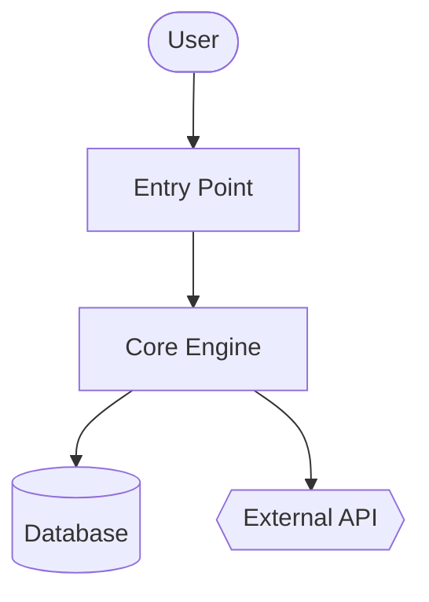

# Architecture

{{TWO_TO_THREE_PARAGRAPHS_SHAPE_OF_SYSTEM}}

## Components

- **{{COMPONENT_1}}** — {{ONE_TO_TWO_SENTENCES}} See [`modules/{{MODULE}}.md`](modules/{{MODULE}}.md).
- **{{COMPONENT_2}}** — {{ONE_TO_TWO_SENTENCES}}

## System Diagram

## Data Flow

1. **{{STEP_1}}** — [`{{FILE}}`]({{LINK}})
2. **{{STEP_2}}** — [`{{FILE}}`]({{LINK}})
3. **{{STEP_3}}** — [`{{FILE}}`]({{LINK}})

## Key Design Decisions

- {{DECISION_1}}
- {{DECISION_2}}
- {{DECISION_3}}
