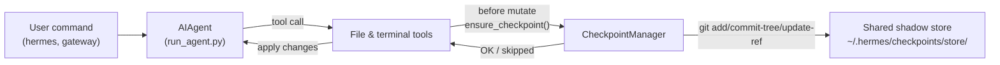

# 检查点与 `/rollback`

Hermes Agent 可以在**破坏性操作**之前自动为你的项目创建快照，并通过单条命令恢复。检查点在 v2 中为**按需启用**——大多数用户从不使用 `/rollback`，且影子存储（shadow-store）随时间增长不可忽视，因此默认关闭。

在会话中通过 `--checkpoints` 启用检查点：

```bash
hermes chat --checkpoints
```

或在 `~/.hermes/config.yaml` 中全局启用：

```yaml
checkpoints:
  enabled: true
```

此安全机制由内部**检查点管理器（Checkpoint Manager）**驱动，它在 `~/.hermes/checkpoints/store/` 下维护一个共享的影子 git 仓库——你真实项目的 `.git` 永远不会被触碰。Agent 操作的所有项目共享同一个存储，因此 git 的内容寻址对象数据库可以跨项目、跨轮次去重。

## 触发检查点的条件

检查点在以下操作之前自动创建：

- **文件工具** — `write_file` 和 `patch`
- **破坏性终端命令** — `rm`、`rmdir`、`cp`、`install`、`mv`、`sed -i`、`truncate`、`dd`、`shred`、输出重定向（`>`），以及 `git reset`/`clean`/`checkout`

Agent 每个目录每轮**最多创建一个检查点**，因此长时间运行的会话不会产生大量快照。

## 快速参考

会话内斜杠命令：

| 命令 | 说明 |
|---------|-------------|
| `/rollback` | 列出所有检查点及变更统计 |
| `/rollback <N>` | 恢复到检查点 N（同时撤销最后一轮对话） |
| `/rollback diff <N>` | 预览检查点 N 与当前状态的差异 |
| `/rollback <N> <file>` | 从检查点 N 恢复单个文件 |

在会话外检查和管理存储的 CLI 命令：

| 命令 | 说明 |
|---------|-------------|
| `hermes checkpoints` | 显示总大小、项目数量及各项目明细 |
| `hermes checkpoints status` | 与裸 `checkpoints` 相同 |
| `hermes checkpoints list` | `status` 的别名 |
| `hermes checkpoints prune` | 强制执行清理：删除孤立/过期条目、GC、强制大小上限 |
| `hermes checkpoints clear` | 清除整个检查点库（会先询问确认） |
| `hermes checkpoints clear-legacy` | 仅删除 v1 迁移留下的 `legacy-*` 归档 |

## 检查点的工作原理

概要流程：

- Hermes 检测到工具即将**修改**工作树中的文件。
- 每轮对话（每个目录）执行一次：
  - 为该文件解析合理的项目根目录。
  - 初始化或复用位于 `~/.hermes/checkpoints/store/` 的**单一共享影子存储**。
  - 写入每个项目的索引，构建树对象，并提交到每个项目的引用（`refs/hermes/<project-hash>`）。
- 这些每项目引用构成可通过 `/rollback` 检查和恢复的检查点历史。



## 配置

在 `~/.hermes/config.yaml` 中配置：

```yaml
checkpoints:
  enabled: false              # 主开关（默认：false — 按需启用）
  max_snapshots: 20           # 每个项目的最大检查点数（通过引用重写 + gc 强制执行）
  max_total_size_mb: 500      # 存储总大小硬上限；超出时丢弃最旧的提交
  max_file_size_mb: 10        # 跳过大于此值的单个文件

  # 自动维护（默认开启）：启动时扫描 ~/.hermes/checkpoints/，
  # 删除工作目录已不存在的项目条目（孤立项）或 last_touch 超过
  # retention_days 的条目。通过 .last_prune 标记控制，
  # 最多每 min_interval_hours 运行一次。
  auto_prune: true
  retention_days: 7
  delete_orphans: true
  min_interval_hours: 24
```

完全禁用：

```yaml
checkpoints:
  enabled: false
  auto_prune: false
```

当 `enabled: false` 时，检查点管理器为空操作，不会尝试任何 git 操作。当 `auto_prune: false` 时，存储持续增长，直到你手动运行 `hermes checkpoints prune`。

## 列出检查点

在 CLI 会话中：

```
/rollback
```

Hermes 返回带有变更统计的格式化列表：

```text
📸 Checkpoints for /path/to/project:

  1. 4270a8c  2026-03-16 04:36  before patch  (1 file, +1/-0)
  2. eaf4c1f  2026-03-16 04:35  before write_file
  3. b3f9d2e  2026-03-16 04:34  before terminal: sed -i s/old/new/ config.py  (1 file, +1/-1)

  /rollback <N>             restore to checkpoint N
  /rollback diff <N>        preview changes since checkpoint N
  /rollback <N> <file>      restore a single file from checkpoint N
```

## 从 Shell 检查存储

```bash
hermes checkpoints
```

示例输出：

```text
Checkpoint base: /home/you/.hermes/checkpoints
Total size:      142.3 MB
  store/         138.1 MB
  legacy-*       4.2 MB
Projects:        12

  WORKDIR                                                       COMMITS    LAST TOUCH  STATE
  /home/you/code/hermes-agent                                        20       2h ago  live
  /home/you/code/experiments/rl-runner                                8       1d ago  live
  /home/you/code/old-prototype                                        3       9d ago  orphan
  ...

Legacy archives (1):
  legacy-20260506-050616                           4.2 MB

Clear with: hermes checkpoints clear-legacy
```

强制执行完整清理（忽略 24h 幂等性标记）：

```bash
hermes checkpoints prune --retention-days 3 --max-size-mb 200
```

## 使用 `/rollback diff` 预览变更

在执行恢复之前，预览自某个检查点以来的变更：

```
/rollback diff 1
```

此命令显示 git diff 统计摘要，随后是完整差异内容。

## 使用 `/rollback` 恢复

```
/rollback 1
```

Hermes 在后台执行：

1. 验证目标提交存在于影子存储中。
2. 对当前状态创建**回滚前快照**，以便之后可以"撤销撤销"。
3. 恢复工作目录中被跟踪的文件。
4. **撤销最后一轮对话**，使 Agent 的上下文与恢复后的文件系统状态一致。

## 单文件恢复

从检查点恢复单个文件，不影响目录中的其他内容：

```
/rollback 1 src/broken_file.py
```

## 安全与性能保障

- **Git 可用性** — 若 `PATH` 中找不到 `git`，检查点功能将透明地禁用。
- **目录范围** — Hermes 跳过过于宽泛的目录（根目录 `/`、家目录 `$HOME`）。
- **仓库大小** — 超过 50,000 个文件的目录将被跳过。
- **单文件大小上限** — 大于 `max_file_size_mb`（默认 10 MB）的文件不纳入快照，防止意外将数据集、模型权重或生成的媒体文件纳入存储。
- **存储总大小上限** — 当存储超过 `max_total_size_mb`（默认 500 MB）时，按轮询方式丢弃每个项目最旧的提交，直到低于上限。
- **真实剪枝** — `max_snapshots` 通过重写每项目引用并随后运行 `git gc --prune=now` 来强制执行，避免松散对象积累。
- **无变更快照** — 若自上次快照以来没有变更，则跳过本次检查点。
- **非致命错误** — 检查点管理器内部的所有错误均以 debug 级别记录；工具继续正常运行。

## 检查点的存储位置

```text
~/.hermes/checkpoints/
  ├── store/                 # 单一共享裸 git 仓库
  │   ├── HEAD, objects/     # git 内部结构（跨项目共享）
  │   ├── refs/hermes/<hash> # 每项目分支尖端
  │   ├── indexes/<hash>     # 每项目 git 索引
  │   ├── projects/<hash>.json  # workdir + created_at + last_touch
  │   └── info/exclude
  ├── .last_prune            # 自动剪枝幂等性标记
  └── legacy-<ts>/           # 归档的 v2 之前每项目影子仓库
```

每个 `<hash>` 由工作目录的绝对路径派生。通常无需手动操作这些文件——使用 `hermes checkpoints status` / `prune` / `clear` 即可。

### 从 v1 迁移

在 v2 重写之前，每个工作目录在 `~/.hermes/checkpoints/<hash>/` 下拥有独立的完整影子 git 仓库。该布局无法跨项目去重对象，且剪枝器有已知的空操作问题——存储会无限增长。

首次运行 v2 时，所有 v2 之前的影子仓库将被移入 `~/.hermes/checkpoints/legacy-<timestamp>/`，使新的单存储布局从干净状态开始。旧的 `/rollback` 历史仍可通过 `git` 手动检查 legacy 归档访问；确认不再需要后，运行：

```bash
hermes checkpoints clear-legacy
```

以回收空间。Legacy 归档也会在 `retention_days` 到期后由 `auto_prune` 清理。

## 最佳实践

- **仅在需要时启用检查点** — 使用 `hermes chat --checkpoints` 或在配置文件中设置 `enabled: true`。
- **恢复前使用 `/rollback diff` 预览** — 查看将发生的变更，选择正确的检查点。
- **使用 `/rollback` 而非 `git reset`** 来撤销 Agent 驱动的变更。
- **定期检查 `hermes checkpoints status`**（如果你经常使用检查点）——显示哪些项目处于活跃状态以及存储占用情况。
- **结合 Git worktree 使用以获得最高安全性** — 将每个 Hermes 会话保持在独立的 worktree/分支中，以检查点作为额外保障层。

关于在同一仓库中并行运行多个 Agent，请参阅 [Git worktrees](./git-worktrees.md) 指南。